# LLM Analytics Architecture

## High-Level Data Flow

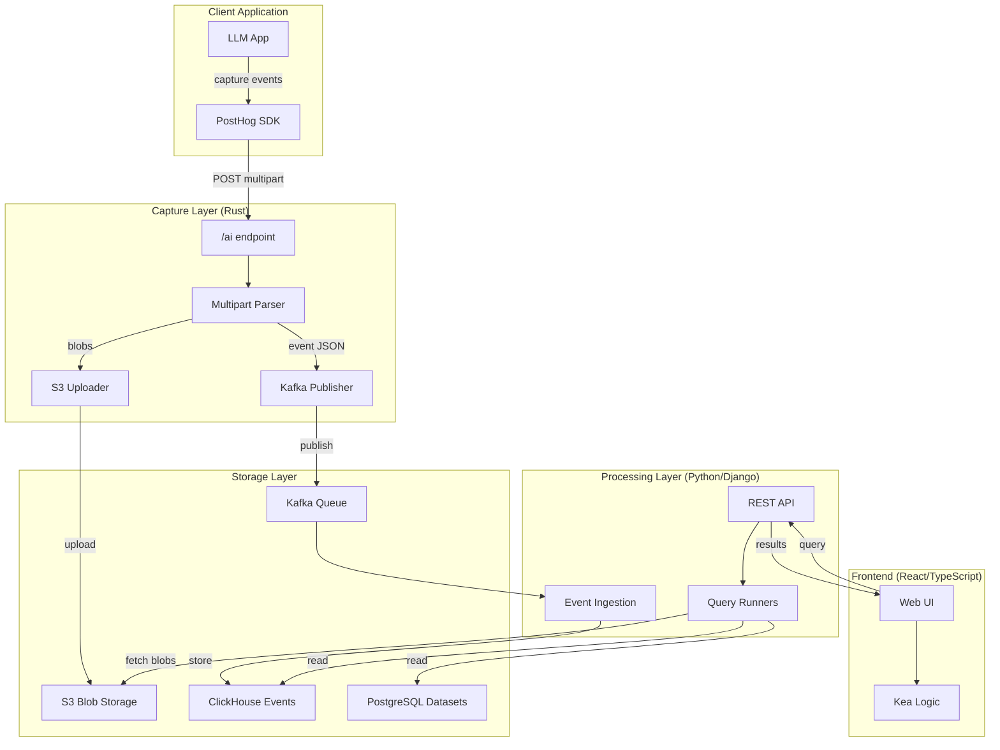

## Capture Pipeline Detail

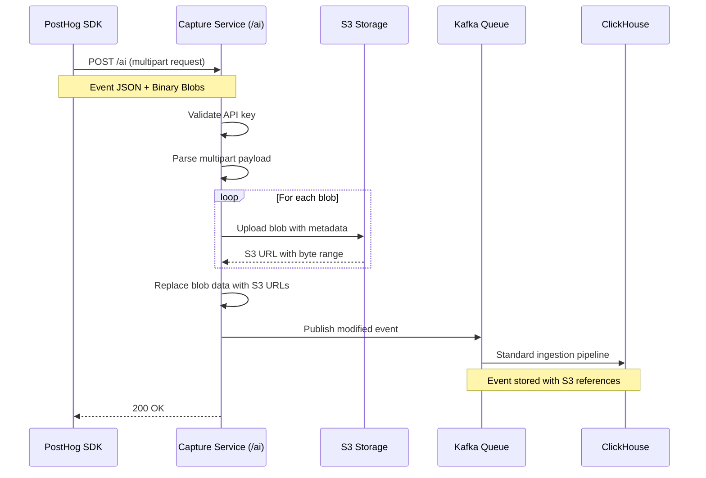

## Trace Query Flow

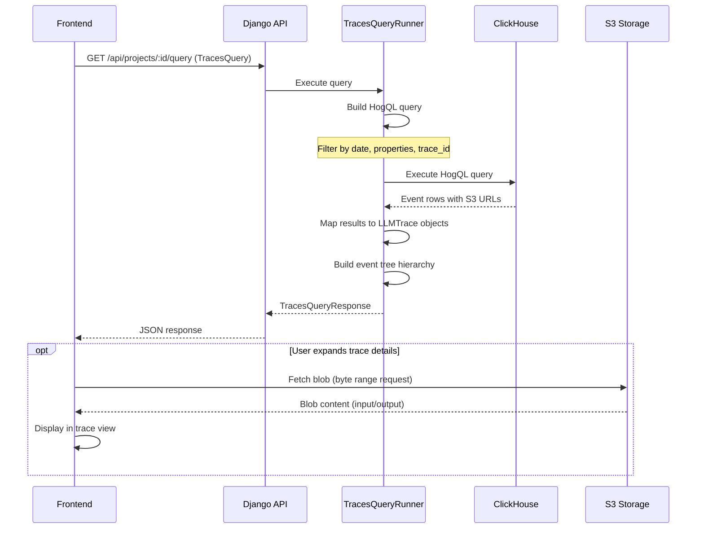

## Event Hierarchy

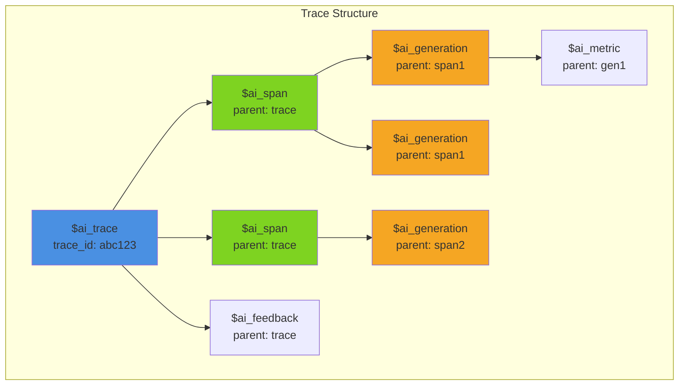

## Frontend Component Architecture

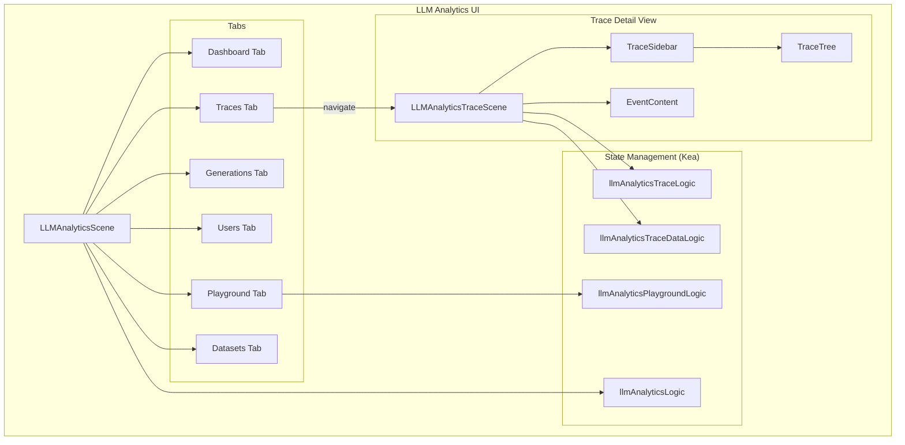

## Data Models

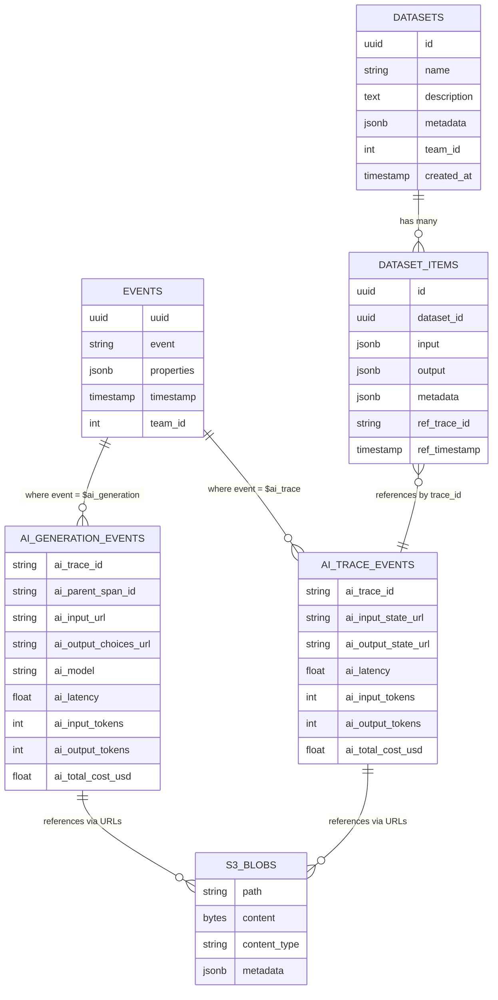

## Playground Architecture

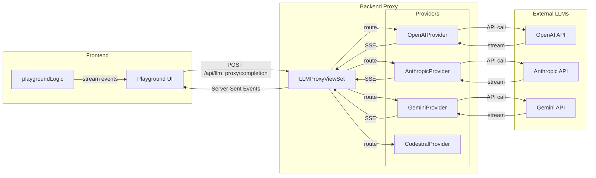

## S3 Blob Storage Structure

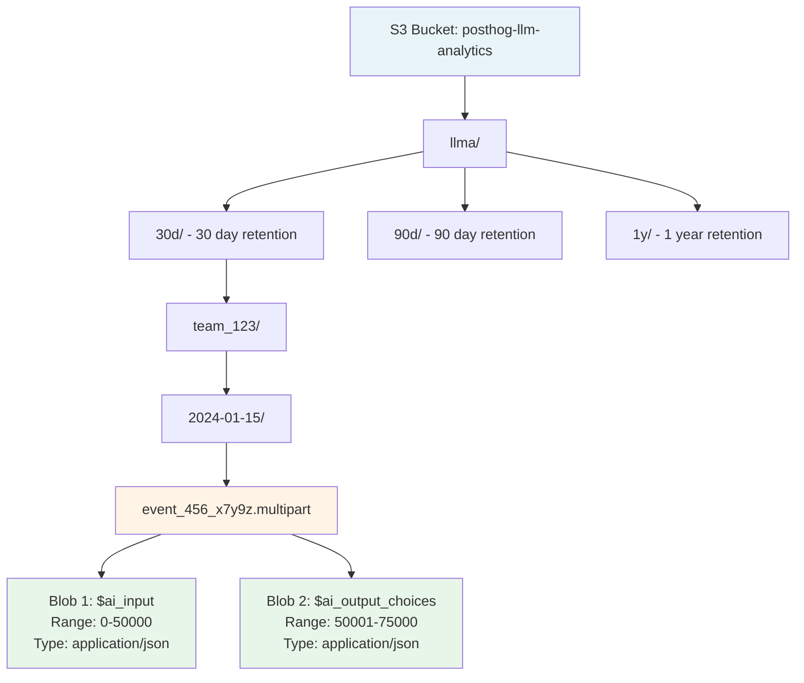

## Query Runner Architecture

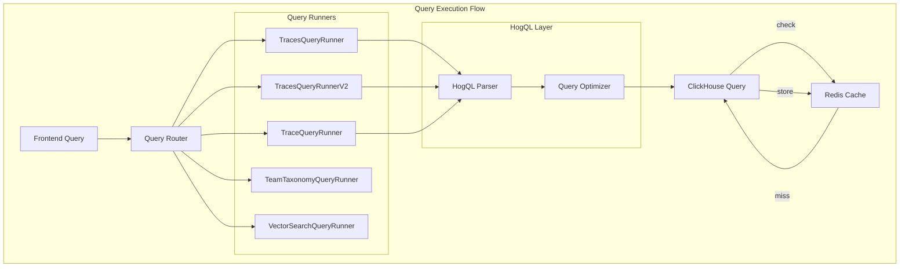

## Authentication & Authorization Flow

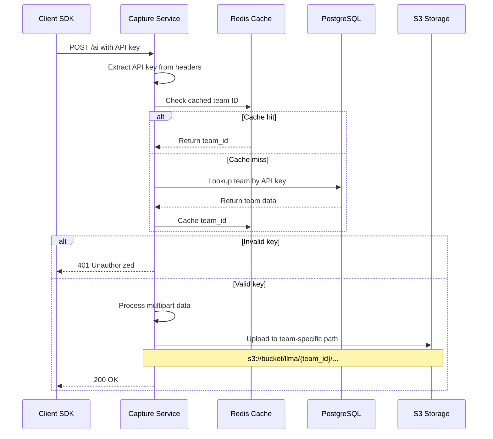

## Evaluation Pipeline (Future)

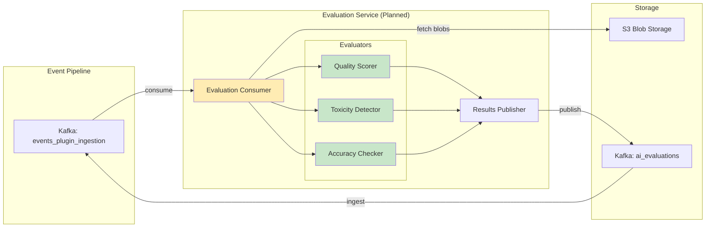

